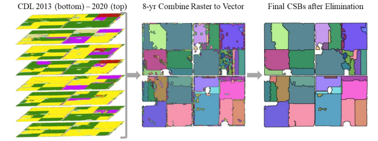

# Crop Sequence Boundaries

Visit the following URL: [https://www.nass.usda.gov/Research_and_Science/Crop-Sequence-Boundaries/index.php](https://www.nass.usda.gov/Research_and_Science/Crop-Sequence-Boundaries/index.php) to download the 'Crop Sequence Boundaries 2016-2023' dataset. After downloading, extract the dataset, which includes crop-field shapefiles for the entire USA. You can then clip these shapefiles to fit your Area of Interest (AOI).

Example: If your research focuses on Maryland, clip the shapefiles for Maryland and save it.

[Crop Sequence Boundaries (CSB): Delineated Fields Using Remotely Sensed Crop Rotations](https://www.nass.usda.gov/Education_and_Outreach/Reports,_Presentations_and_Conferences/reports/conferences/ICAS-2023/Crop%20Sequence%20Boundaries%20%28CSB%29%20Delineated%20Fields%20Using%20Remotely%20Sensed%20Crop%20Rotations.pdf). 
USDA-NASS & Global Conservation Institute.
Hunt, K. A., Abernethy, J., Beeson, P., Bowman, M., Wallander, S., & Williams, R. (Year). 

