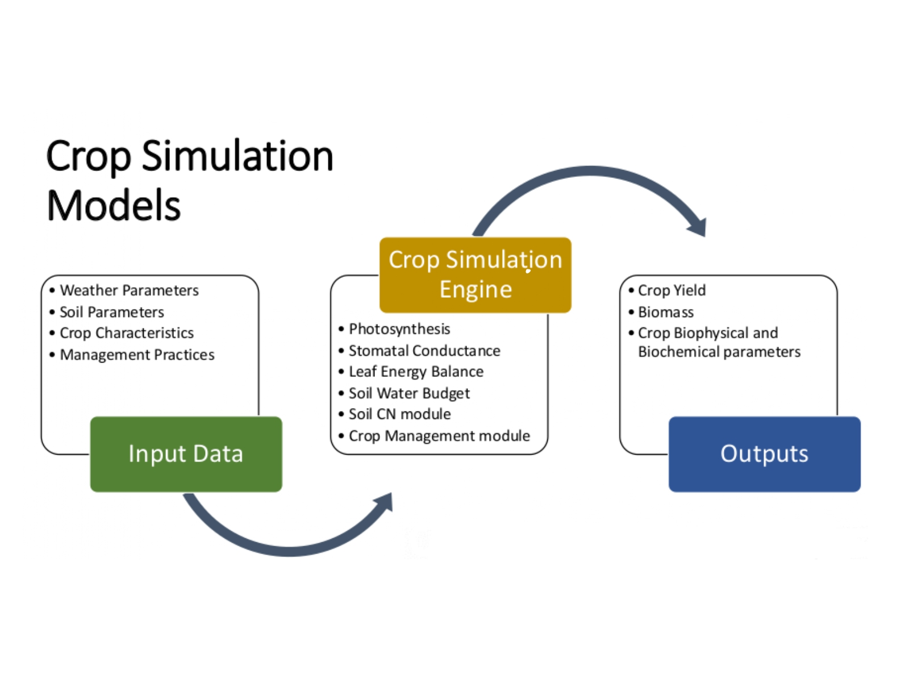

## ENVIRONMENTAL POLICY INTEGRATED CLIMATE (EPIC) MODEL

EPIC model is a cropping systems simulation tool designed to assess the impact of erosion on soil productivity. Its development stemmed from the critical need for improved technology, identified in the 1980 Soil and Water Resources Conservation Act analysis, to evaluate the consequences of soil erosion on agricultural output. EPIC employs a single crop growth model with unique parameter sets for approximately eighty different crops. This enables the model to simulate the effects of various management practices on soil, water, nutrients, and pesticide dynamics.  EPIC can further integrate these effects to predict long-term consequences for homogeneous soil and management areas, including soil loss, water quality, and crop yields.

The EPIC model offers high temporal resolution, simulating agricultural systems on a daily basis for extended periods.  Continuously refined since its development, EPIC incorporates algorithms to model water quality, nutrient cycling, climate change impacts, and atmospheric CO2 effects.  This comprehensive model allows configuration for diverse cropping systems, management practices, and assesses erosion costs to aid in optimizing agricultural strategies.

For more details, read this: [https://epicapex.tamu.edu/media/rckfgmxs/epic1102-user-manual-2024-01-24.pdf](https://epicapex.tamu.edu/media/rckfgmxs/epic1102-user-manual-2024-01-24.pdf)
